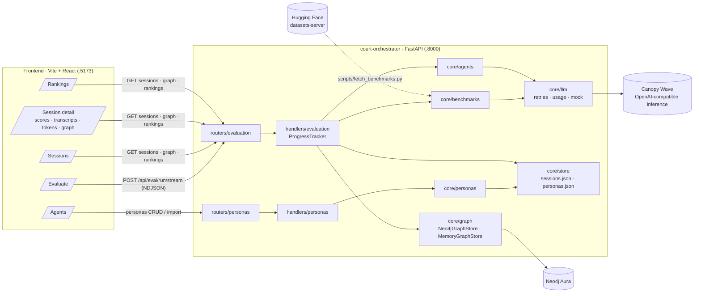

# System Design — Model Evaluation Arena

*Energetic-Goose · branch `evaluation` · September 2026*

## 1. Goal

Rank cutting-edge LLMs (Chinese and US) with a score we own:

```
final = w · benchmark_score + (1 − w) · agent_score          (default w = 0.5)
```

* **Benchmark session** — accuracy on open-source benchmarks (MMLU, GSM8K, ARC-Challenge,
  TruthfulQA-MC1, HellaSwag).
* **Agent session** — simulated users with personalities converse with the model, then fill in a
  feedback form. Each persona's score is the mean of its 1–10 ratings weighted by what *that
  persona* cares about (helpfulness / accuracy / clarity / tone / trust).
* Every interaction is mirrored into a **Neo4j graph** so we can ask *how* each kind of user used
  each model, not only how it scored.

## 2. Architecture



Two products share one service and one SPA: the original **AI Court** (`/`, `/api/court/*`) and the
**evaluation arena** (`/evaluate`, `/sessions`, `/rankings`, `/agents`, `/api/eval/*`). The service
keeps its layered convention: Pydantic `models/` → `handlers/` (business logic) → `routers/`
(thin) → `main.py`; non-HTTP infrastructure lives in `core/`; the middleware chain
(`env_loader → cors → datacat → preflight`) validates configuration before serving.

## 3. Evaluation workflow

```mermaid
sequenceDiagram
  autonumber
  participant U as User (browser)
  participant API as FastAPI /api/eval/run/stream
  participant T as ProgressTracker
  participant B as Benchmark runner
  participant Sim as Simulator model<br/>(plays each persona)
  participant M as Model under test
  participant G as Graph (Neo4j)
  participant DB as sessions.json

  U->>API: models[], agent_ids[], benchmarks[], items, turns, weight
  API->>DB: create session (status=running)
  API->>G: MERGE (:Model), (:Session)-[:EVALUATES]->(:Model), (:Agent)-[:PARTICIPATED_IN]->(:Session)
  API-->>U: session_created

  rect rgb(30,40,60)
    note over API,M: ① Benchmark evaluation (items run 4-wide)
    loop each benchmark × sampled items
      B->>M: question (+ choices) → letter / "#### number"
      M-->>B: answer + token usage
      B->>T: item done (tokens, latency)
      API-->>U: benchmark_item · progress {percent, elapsed, ETA, tokens}
    end
    API->>G: (:Session)-[:RAN_BENCHMARK {score,correct,total,tokens}]->(:Benchmark)
    API-->>U: benchmark_result
  end

  rect rgb(50,40,30)
    note over API,M: ② Simulated users testing (all personas in parallel)
    par for each persona
      loop round 1..N
        alt round 1
          note over Sim: scripted opening message (no call)
        else
          Sim->>Sim: next user message in character
        end
        Sim->>M: user message
        M-->>Sim: reply + usage
        API->>G: (:Agent)-[:SENT]->(:Turn)-[:NEXT]->(:Turn)<-[:REPLIED]-(:Model)
        API-->>U: agent_turn (tokens, by=simulator|target) · progress
      end
      Sim->>Sim: feedback form → JSON ratings, summary, quote
      API->>G: (:Agent)-[:GAVE]->(:Feedback)-[:ABOUT]->(:Model), [:INTERACTED_WITH {score,tokens}]
      API-->>U: agent_feedback (score, rounds, tokens)
    end
  end

  note over API: ③ Scoring
  API->>API: final = w·bench + (1−w)·agents; roll up tokens & timings
  API->>DB: status=done
  API->>G: SET session.final_score, total_tokens
  API-->>U: progress 100% · session_done
```

The stream is NDJSON, one JSON object per line. A client that disconnects loses nothing: every
step is persisted to the session document as it happens, so `/sessions/{id}` shows a running
session's progress, transcripts and partial graph.

## 4. Scoring

| Piece | Definition |
|---|---|
| Benchmark accuracy | correct / total per benchmark, letter match for multiple choice, numeric match (tolerance 1e-6) for GSM8K |
| `benchmark_score` | mean of per-benchmark accuracies × 100 |
| Persona rating | 1–10 on helpfulness, accuracy, clarity, tone, trust, written by the simulator *as the persona* |
| Persona score | Σ rating_d · priority_d / Σ priority_d × 10 (0–100) |
| `agent_score` | mean of persona scores (errored personas excluded) |
| `final_score` | w · benchmark_score + (1 − w) · agent_score |
| Rankings | per model over completed sessions: avg / best / latest final, avg benchmark, avg agents; sorted by avg final |

Persona priorities are normalised to sum to 1 on import. Strictness and patience shape the
simulator's behaviour through the system prompt rather than the arithmetic.

## 5. Progress, ETA and token accounting

`ProgressTracker` counts **model calls** as units:

```
units_total = Σ_benchmarks min(items, |benchmark|)  +  |agents| × 2 × turns
              └── ① benchmark items ──┘                └── (turns−1) simulator + turns target + 1 feedback ──┘
```

After every call it emits `progress` with percent, elapsed seconds, running tokens and an ETA:

```
ETA = remaining_items × (bench_elapsed / items_done)
    + remaining_agent_calls × agent_rate
agent_rate = agents_elapsed / agent_calls_done                 once the agent stage has data
           = max(0.5 s, avg_item_latency × 3.5 / |agents|)      before that (flagged "estimate")
```

Token usage comes from the provider's `usage` block; when absent it is estimated at 4 chars /
token and flagged `estimated`. Every turn records `by` (`target`, `simulator`, `script`) and
`tokens`, so a finished session exposes tokens per benchmark, per agent (target / simulator /
feedback) and per conversation round, plus wall-clock seconds per stage.

## 6. Graph model (Neo4j)

```
(:Model {name, vendor, region})
(:Session {id, status, weights, benchmark_score, agent_score, final_score, total_tokens})
(:Agent {id, name, avatar, role, traits[], language})
(:Benchmark {name, source, task_type})
(:Turn {id, index, round, role, by, content, latency_ms, tokens, session_id, agent_id})
(:Feedback {id, score, rating_*, summary, quote, would_use_again, tokens, session_id, agent_id})

(Session)-[:EVALUATES]->(Model)
(Session)-[:RAN_BENCHMARK {score, correct, total, tokens}]->(Benchmark)
(Agent)-[:PARTICIPATED_IN {session_id}]->(Session)
(Agent)-[:SENT]->(Turn)      (Model)-[:REPLIED]->(Turn)      (Turn)-[:NEXT]->(Turn)
(Turn)-[:IN_SESSION]->(Session)
(Agent)-[:GAVE]->(Feedback)-[:ABOUT]->(Model)     (Feedback)-[:IN_SESSION]->(Session)
(Agent)-[:INTERACTED_WITH {session_id, turns, score, tokens_target, tokens_simulator}]->(Model)
```

`Model`, `Agent` and `Benchmark` nodes are shared across sessions (MERGE on their key), which is
what lets Cypher answer cross-session questions, e.g. *which personas consistently rate a model
lower than the benchmarks would suggest?*

```cypher
MATCH (a:Agent)-[i:INTERACTED_WITH]->(m:Model)
RETURN m.name, a.name, avg(i.score) AS avg_user_score, count(i) AS sessions
ORDER BY m.name, avg_user_score
```

Backend selection: `NEO4J_URI` set and reachable → `Neo4jGraphStore` (unique constraints per
label, per-session subgraph query, read-only Cypher endpoint); otherwise `MemoryGraphStore` with
the same API, persisted to `var/graph.json`. Graph writes run in a worker thread so remote Aura
round-trips never stall the event stream. The UI lays the subgraph out radially (model at the
centre, one spoke per user, turns along the spoke, feedback beyond, session + benchmarks above).

## 7. Data & configuration

| Where | What |
|---|---|
| `app/data/benchmarks/*.json` | bundled sample subsets (HF field names); `var/benchmarks/` from `scripts/fetch_benchmarks.py` overrides |
| `app/data/personas/default_personas.json` | the five built-in personas; the personas collection is seeded from it |
| `var/sessions.json`, `var/personas.json`, `var/graph.json` | local state (gitignored) |
| `.env` | `CANOPYWAVE_API_KEY/BASE_URL`, `EVAL_SIMULATOR_MODEL`, `EVAL_MOCK`, `NEO4J_URI/USER/PASSWORD[/DATABASE]` |

Persona schema (import): `name`, `scenario.opening_message` required; `avatar`, `tagline`, `age`,
`occupation`, `language`, `background`, `personality_traits[]`, `communication_style`,
`expertise_level`, `patience`, `strictness`, `priorities{}`, `scenario{title, goal,
success_criteria[]}` optional with defaults.

## 8. API surface

| Method & path | Purpose |
|---|---|
| `GET /api/eval/meta` | catalog (CN/US), platform models, benchmarks, weights, simulator, graph backend |
| `POST /api/eval/models/probe` | one tiny call per model → which ids this key can use |
| `POST /api/eval/run` · `/run/stream` | evaluate models (blocking / NDJSON stream) |
| `GET /api/eval/sessions` · `/{id}` · `DELETE /{id}` · `POST /{id}/rerun/stream` | session management |
| `GET /api/eval/sessions/{id}/graph` | nodes + relationships (+ Cypher) for the session |
| `GET /api/eval/rankings` | leaderboard |
| `GET /api/eval/graph/status` · `POST /api/eval/graph/cypher` | backend status; read-only Cypher (Neo4j only) |
| `GET/PUT/DELETE /api/eval/personas[/{id}]` · `POST …/import` · `POST …/reset` | persona management |

## 9. Failure handling

* A model call never raises into the pipeline: `ChatResult.status="error"` carries the failure,
  the item is graded wrong / the turn is recorded as an error, and the persona still judges.
* A persona whose feedback cannot be parsed is marked `error` and excluded from `agent_score`.
* A graph write failure is logged and ignored (the graph is a mirror, the session document is the
  source of truth). Deleting a session also removes its subgraph.
* The stream ends with an `error` event on unexpected exceptions; the session document is marked
  `error` with the message.

## 10. Known limits / next steps

* Only two platform models answer on the current key (minimax-m3, kimi-k2.6); US models need a
  platform that serves them (the code is provider-agnostic: any OpenAI-compatible base URL).
* GSM8K items are slow (chain-of-thought up to 1200 tokens); consider a per-benchmark token cap.
* Persona feedback is single-shot; a "reflection" pass or a second judge model would reduce
  variance. Sessions per model could be aggregated with confidence intervals on the rankings page.
* Neo4j cross-session analytics (persona × model heat-map) would make a natural next page.
